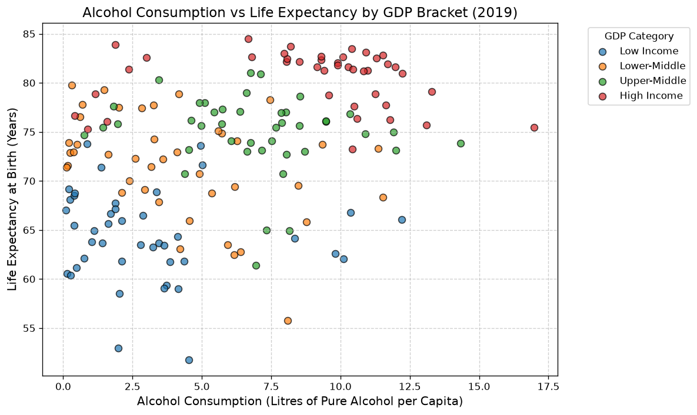
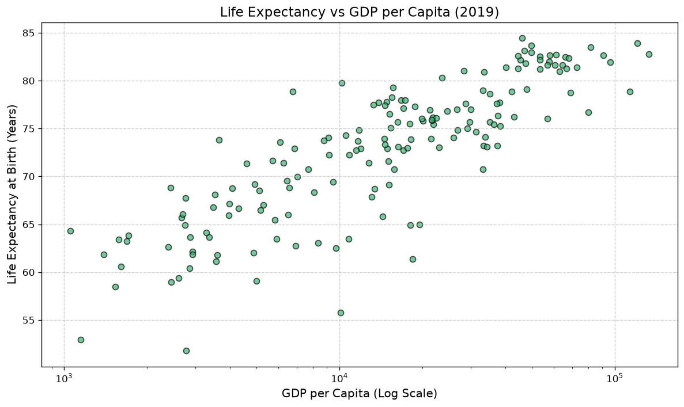

# Alcohol Consumption vs Life Expectancy — a Simpson's paradox worked example

Across countries (2019 data), **higher alcohol consumption correlates *positively* with life
expectancy** (r ≈ +0.37). Split the *same* countries into income quartiles and the correlation
is **zero-to-negative in every quartile**. GDP per capita is a confounder driving the pooled
association — a textbook sign reversal (Simpson's paradox).

This repo is a small, self-contained **data-wrangling exercise in pandas**: take three
country-level indicators from separate sources, join them on ISO country code, handle the
messy edges *explicitly* rather than silently, and test whether a headline correlation
survives stratification.

---

## Key result

| Sample | alcohol ↔ life expectancy (Pearson r) | n |
|---|---:|---:|
| **All countries (pooled)** | **+0.37** | 169 |
| Low Income quartile | −0.08 | 43 |
| Lower-Middle quartile | −0.39 | 42 |
| Upper-Middle quartile | −0.15 | 42 |
| High Income quartile | −0.03 | 42 |



Each colour is an income quartile. Within any one quartile the cloud is flat-to-declining;
the upward pooled tilt comes from the quartiles sitting at different heights — richer bands
are both further right (more alcohol) and higher up (longer life).

Supporting pooled correlations: alcohol ↔ GDP = **+0.41**, life expectancy ↔ GDP = **+0.71**.
Richer countries both drink more *and* live longer, which manufactures the positive pooled
alcohol–longevity association. Condition on wealth and it vanishes. The GDP ↔ life-expectancy
half of that is the familiar Preston curve:



Splitting by **continent** instead does **not** produce a clean reversal:

| Continent | r | n |
|---|---:|---:|
| Africa | −0.01 | 48 |
| Asia | −0.01 | 42 |
| Europe | −0.12 | 38 |
| South America | +0.19 | 11 |
| North America | +0.45 | 20 |
| Oceania | +0.89 | 10 |

Continent gives a noisy, mixed picture (and Oceania's +0.89 rests on 10 countries). Income,
not geography, is the confounder that explains the pooled sign.

---

## The question

Naively correlating alcohol consumption against life expectancy across countries gives a
*positive* number, which is easy to misread as "drinking is associated with living longer."
The goal here was to (a) build the joined dataset cleanly and (b) check whether that
correlation is real or an artifact of a lurking variable. It is an artifact: **GDP per
capita**.

---

## Data

All three indicators are country–year panels; we use a single cross-section (`TARGET_YEAR = 2019`).

| File | Indicator | Original source |
|---|---|---|
| `data/total-alcohol-consumption-per-capita-litres-of-pure-alcohol.csv` | Litres of pure alcohol per capita | WHO Global Health Observatory, via Our World in Data |
| `data/life-expectancy-at-birth-who-gho.csv` | Life expectancy at birth (years) | WHO GHO, via Our World in Data |
| `data/gdp-per-capita-worldbank.csv` | GDP per capita (int'l $) | World Bank, via Our World in Data |
| `data/country-and-continent-codes-list-csv.csv` | ISO alpha-3 ↔ country name ↔ continent | public country-codes list |

Per-source documentation from the providers is kept alongside each CSV (`*.readme.md`).

---

## Pipeline

The join key throughout is the **ISO 3166-1 alpha-3 code** (`ISO_Code`). Every merge is an
**inner join**, so a country is in the final sample only if it is present in *all* sources.

**1. Build a clean country reference table.** From the country/continent list:
   - drop rows with no ISO code (disputed territories, neutral zones — a missing key can't be joined on);
   - resolve ISO codes that appear **twice** because the country spans two continents
     (see next section) — this yields one row per code (`df_country_code_clean`, 250 codes);
   - `assert` no duplicate codes survive, so a future data refresh can't silently reintroduce one.

**2. Filter the three indicator tables** to real countries (drop regional/income aggregates
   such as `OWID_WRL`, `WB_SSA`, `WHO_EUR` — they carry codes but aren't countries) and to
   `TARGET_YEAR`.

**3. Merge:** `alcohol ⋈ life expectancy` → `+ continent` → `+ GDP`.

**4. Analysis sample:** optionally drop countries below `alcohol_threshold`
   (0.1 L/capita — near-zero-consumption countries, almost all with legal prohibition),
   then cut GDP per capita into quartile brackets and compute correlations overall, by
   continent, and by bracket.

Row waterfall for 2019:

```
ISO reference universe (deduped country/continent table)     250
  - missing from >=1 of alcohol / life / GDP                 -73
  = present in all three sources                             177
  - below alcohol threshold (0.1 L pure alcohol / capita)     -8
  = final analytic sample                                    169
```

`analysis_extended.py` writes `outputs/country_tracker.csv`: one row per reference country
with 0/1 flags for presence in each source and in the final sample — so every dropped
country is accounted for by name and stage, not just by a shrinking row count.

---

## The transcontinental-ISO decision (and why it matters)

Eight ISO codes appear on two rows in the country/continent list because the country (or its
outlying territories) straddles two continents: **ARM, AZE, CYP, GEO, KAZ, RUS, TUR, UMI**.
A one-to-one join needs exactly one continent per code.

The quick fix — `drop_duplicates(subset=['Code'], keep='first')` — keeps whichever row the
source happened to list first. Here that is **Europe** for all seven of the Caucasus/Anatolia
codes. `analysis_extended.py` instead assigns each one explicitly (by share of land area:
Russia, Turkey, Kazakhstan, the Caucasus states → **Asia**; US Minor Outlying Islands →
Oceania), and documents the rule and its judgement calls in the code.

This is not cosmetic. It changes the by-continent result:

| Continent | `keep='first'` (basic) | explicit rule (extended) |
|---|---:|---:|
| Europe | r = **+0.05**, n = 45 | r = **−0.12**, n = 38 |
| Asia | r = −0.02, n = 35 | r = −0.01, n = 42 |

Seven countries moving between groups **flips the sign of Europe's correlation**. The pooled
Simpson's-paradox result holds either way, but the continent breakdown is only trustworthy
once the assignment is deliberate.

---

## Two implementations

| | `analysis_basic.py` | `analysis_extended.py` |
|---|---|---|
| Purpose | shortest path to the answer | same answer, defensible at every step |
| Deduplication | `keep='first'` (implicit) | explicit per-code rule + safety-net `assert` |
| Aggregate rows (`OWID_*`, `WB_*`) | removed incidentally by a later join | filtered up front against the reference table |
| Missing keys | assumed absent | asserted |
| Where countries drop | two printed totals | full waterfall + per-country `outputs/country_tracker.csv` |
| Cross-check | — | tracker counts `assert`-ed equal to the merge-chain counts |
| Plotting | five near-identical blocks | one `scatter_plot()` helper |

Both produce the same headline numbers (169 countries, pooled r = +0.37, the same
GDP-quartile reversal). The extended version exists to make each cleaning choice visible and
checkable — the point of the exercise.

---

## Running it

Requires Python 3.13, pandas 3.0, matplotlib 3.11 (pinned in `requirements.txt`).

```bash
python3.13 -m venv .venv
.venv/bin/python -m pip install -r requirements.txt

.venv/bin/python analysis_extended.py     # waterfall + correlations; writes outputs/ (tracker CSV + 2 figures); shows 5 plots
.venv/bin/python analysis_basic.py        # the minimal version
```

Change the cross-section or the low-consumption cutoff at the top of either script
(`TARGET_YEAR`, `EXCLUDE_LOW_ALCOHOL`, `alcohol_threshold`).

---

## Repo layout

```
analysis_basic.py       minimal pipeline
analysis_extended.py    same pipeline, explicit cleaning + membership tracker + assertions
requirements.txt        pinned dependencies
data/                   the four source CSVs + provider readmes
outputs/                written by analysis_extended.py:
                          country_tracker.csv               per-country in/out flags at each stage
                          alcohol_vs_life_by_gdp_bracket.png headline figure
                          life_vs_gdp.png                    Preston curve
```

---

## Notes & limitations

- **Cross-sectional, observational.** Correlations only; nothing here supports a causal claim
  about alcohol and longevity. The exercise is about the confounding structure, not a health finding.
- **GDP quartiles are coarse.** Four bins is enough to show the reversal; a partial correlation
  or a regression with `log(GDP)` as a continuous control would quantify it properly.
- **Country name is part of the first join key**, which would drop a country if two sources
  spelled it differently; for this year and these sources there are no such mismatches (the
  first merge loses rows only to missing ISO codes).
- `2019` is the last year with near-complete coverage across all three sources.
